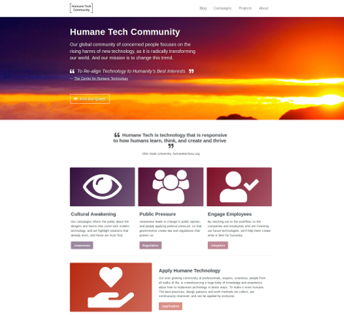

# "Aware Prepare" Campaign

<!-- Please fill in the information below each header according to the instructions.

       - Do NOT remove section headers. Instead add the placeholder text if the section is not needed.
       - You can leave the comments. They can be helpful when editing the issue later on.
       - Replace brackets with appropriate information (unless part of a link), leaving formatting intact.
       - The non-comments texts below provide examples, unless they are placeholder text

    Note: You will not be wasting your time documenting all this. The information in this issue
          should be copied to the Campaign README.md after your feedback is incorporated.
-->

## Info 

<!-- Provide short name that reflects the gist of the campaign, used as working title.
      Also add the link to community forum topic that is used for general discussion. -->

- Name: **Aware Prepare**
- Theme: [Dogfooding](themes/dogfooding/README.md)
- Status: Launched
- Affilliation: Official
- Original idea: N/A
- Coordinator: [aschrijver](https://community.humanetech.com/u/aschrijver/summary)
- General discussion: [This forum topic](https://community.humanetech.com/t/aware-prepare-growth-hacking-the-awareness-campaigns-project/2839)

## Summary 

<!-- Clear and concise explanation in 1-3 lines of text. -->

Crowdsourcing means, finding a crowd of contributors. This campaign is about growth hacking the public to find as much people willing to participate, so that our campaign efforts get ever more effective.

## Goals

<!-- Bullet list of the intended effects of the campaign, separated by empty lines. -->

- Reach out to the target audience across the personal channels of community members.

- Entice people to join as cooperator, and guide them through the onboarding process.

- Help new cooperaters to find fitting project roles and activities to participate in.

## Audience

<!-- The demographic audience the campaign is targeted to. -->

- Every person that is a serious prospect to become a true Humane Tech activist.
  - This means willing to help campaigning, willing to spend time improving.

## Success criteria

<!-- (optional) Bullet list detailing how success is measured. -->

The success criteria will need to be updated as the project comes along, but currently are:

- Maintain a steady growth of activists and campaigners across the 5 stages of involvement (see [Strategy](#strategy).
- Daily and growing activity on open tasks in the project Issue tracker, and reporting back to the forum.
- Assignment of active cooperators to newly defined project roles, to distribute project responsibilities.

## Retrospective

<!-- (optional) Analysis of results after campaign has ended, to see if success criteria were met, and to learn lessons for future campaigns. Use the placeholder text is no retrospective was held yet. Add a date indicator if possible (e.g. 'after 3 months', '24-11-2018'). -->

- No retrospective has been held yet.
- Retrospectives will be held in quick success to adopt lessons-learned asap.

## Description

<!-- A longer, more elaborate description (one or more paragraphs of text) -->

The awareness campaigns that are defined in this project are complex beasts. They involve lots of skills, coordination and activity by many contributors. A single campaign can only succeed if there are enough of the right people willing to spend their time on it. Likewise, the more contributors we find, the more campaigns that we can work on in parallel.

So the first part of this campaign involves the community building and growth hacking that is required to get more people on board.

The second - and even more important - part, constitutes of improving the onboarding process, so that:

- People feel directly at home, and can inform themselves on how best to start contributing.
- New members become active in this campaign and help with the growth hacking of the project.

Finally, to keep the project manageable, the project responsibilities need delegated to separate project roles that have people assigned to them that are willing and able to fulfill them.

## Deliverables

<!-- Sub-headers with the planned deliverables and their summaries. Update this later to reflect changes.  The second sub-header gives an example. -->

### Documentation: [Project Guide](deliverable-url) (TODO)

As we go along, and more members join, we learn from the questions they ask us, and the problems they have. This experience is used to improve both the project structure and workflows and documenting them in this Project Guide.

This way we'll have to spend ever less time with the 'boring stuff' and more on reaching the public in exciting campaigns.

### Activity: [We Need You](deliverable2-url) (TODO)

This is an application of the [Turning the weapon around](https://community.humanetech.com/t/idea-turning-the-weapon-around-raising-awareness/423) idea on the forum, a ongoing activity, where project members reinforce each other's social media promotion, by adding their own Likes, Shares, and add Comments.

The added reward for participants in this activity is, that they can become more influential in their own social media channel, e.g. on LinkedIn, and develop their reputation.

### Documentation: [Growth Hacking Guide](deliverable2-url) (TODO)

As part of the _We Need You_ activity we will frequently update a Growth Hacking Guide with our lessons-learned - adding the things that worked best. This way others don't make the same mistakes when they first chime in to the growth hacking process, and campaign effectiveness continues to increase.

The benefits and rewards will be developing strategies that can be applied to other campaigns and developing our own social media strategic skillset.

### Website: [Humane Tech Community Home](https://github.com/humanetech-community/humanetech-community-website) (IN PROGRESS)

The website at [`humanetech.community`](https://humanetech.community) is under construction. Landing page is ready:

Our community forum is just that: A discussion forum. The community needs an online presence to present itself and our ongoing activities to the outside world. This deliverable involves setting up the website at `humanetech.community` in a way that makes it easy to maintain collectively by our members.

The community website will be a place for blogging, news & announcements, meetup calendars and meetup sub-pages, project overviews and other subsections where specific Humane Tech topics can be addressed (like e.g. [Humane Tech Certification](https://community.humanetech.com/t/idea-humane-technology-logo-program/778) program, the crowd-sourced [Ledger of Harms](https://ledger.humanetech.com), etc.), and more.

## Strategy

<!-- Outline the (draft) strategy required to attain the success criteria (one or more paragraphs of text, use formatting - like lists - where appropriate). Use this placeholder text if this section is not needed:

- This campaign does not require a strategy. Strategy is defined on the Theme, or in Deliverables.
 -->

Growth hacking for awareness campaigns ultimately means finding the right people that can work together efficiently and be productive campaigners. Though we want to lower the barrier to participation as much as possible, many people need to be gradually instructed and helped along the onboarding process. This process is important, as we do not want people on the sidelines that obstruct this process, hampering progress or even actively try to demolish the project (e.g. trolls).

Therefore onboarding will go through 5 different stages of ever deeper involvement and participation:

0. It starts with the CHT Facebook group. People here are not community members. They are **prospects**.
1. Then we have the community forum, with ‘readers’ and more active **members** who post and discuss.
2. Going to Awareness Campaigns, we have the Campaigners group, with our **campaigners**, this team.
3. Followed by **contributors** and **maintainers** of the Github awareness project.
4. Broadening out, we have **team members** of the Github organization that work across all projects.
5. And finally at individual issue (or task) level we have **assignees** responsible for tasks.

The Aware Prepare campaign is long-running (never ends), and the separate [Strategy document](strategy-document.md) defines the activities that are planned.

Strategy details:

- [Social media channels](campaign-strategy.md#social-media-channels)
- [Ongoing activities](campaign-strategy.md#ongoing-activities)
- [Activity planning](campaign-strategy.md#activity-planning)

## Funding

<!-- (optional) Financial requirements, required budget, ways to obtain funds (keep it short, couple of paragraphs, some bullets). If necessary link to separate detailed funding document. Use the placeholder text if no funding is required. -->

- No funding is required to execute this campaign. 

## Milestones

<!-- (optional) Bullet list of past and future milestones for the campaign. Or placeholder bullet "No milestones have been defined." -->

- Milestones should still be determined, but none are required right now

## Resources

<!-- (optional) Links to relevant folders, files and external information, or leave the placeholder text. -->

- This theme has no additional resources. Please edit or comment to add your relevant links.
