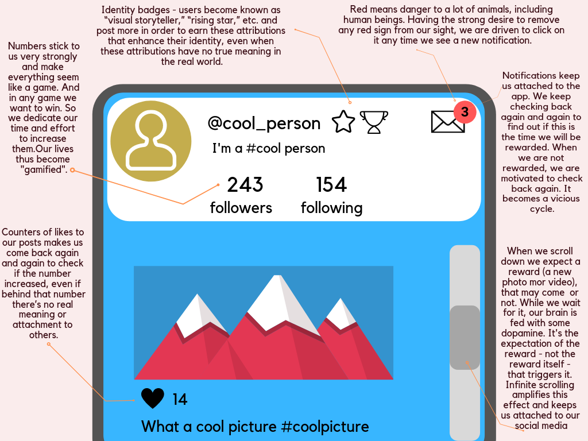
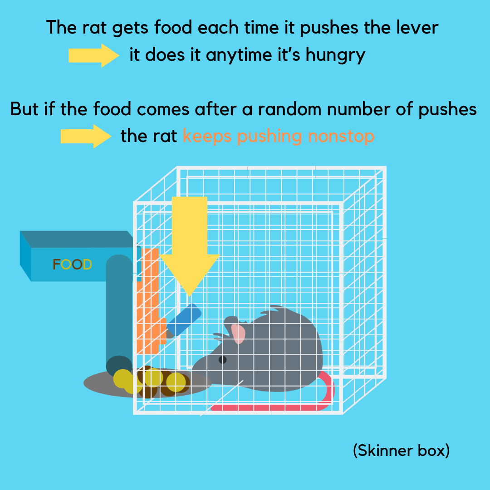
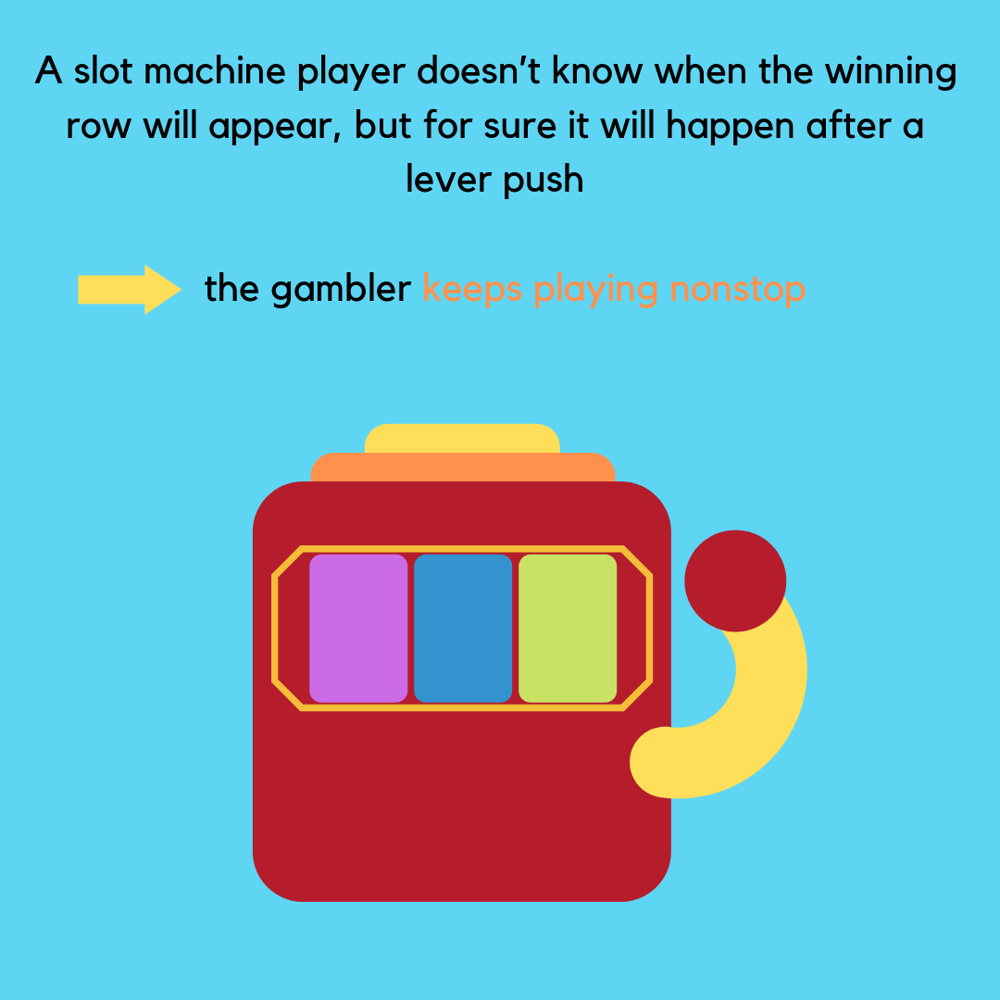
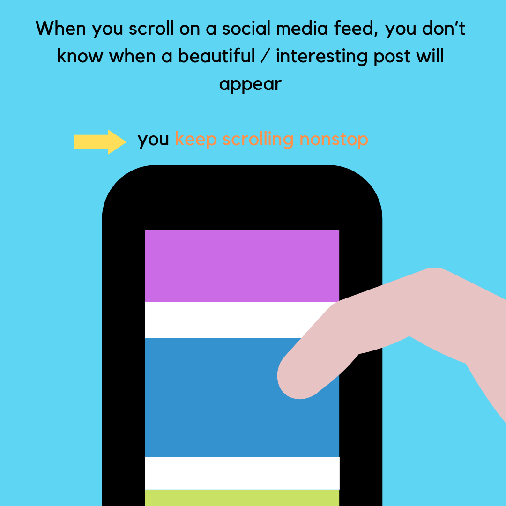
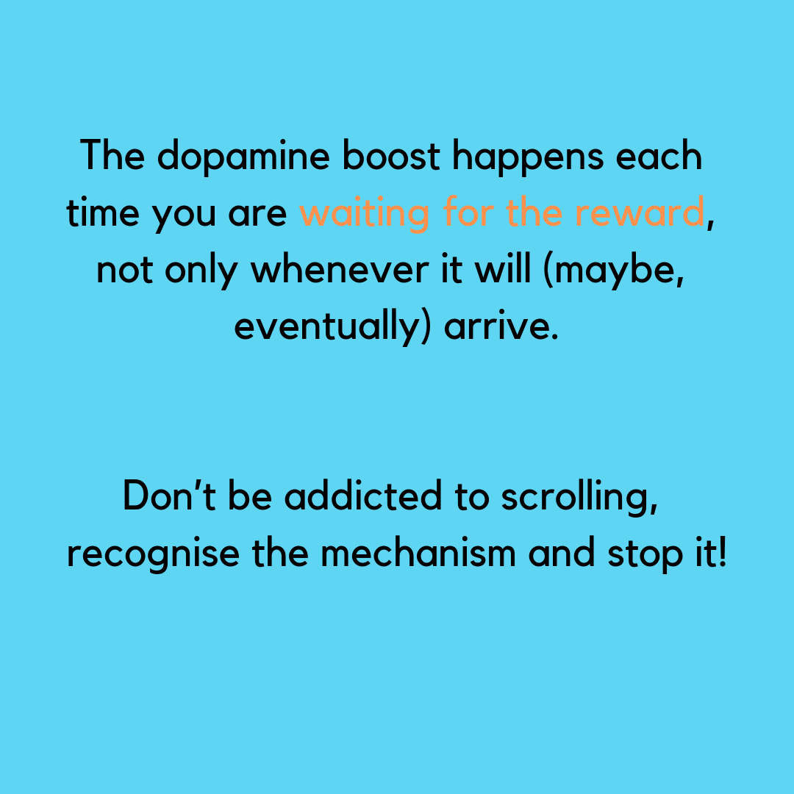

 # Harmful design in social media UI

Some infographics to increase awareness about how social media (and other sites) are designed in order to attract and distract users. 

 ## Variable reward system

