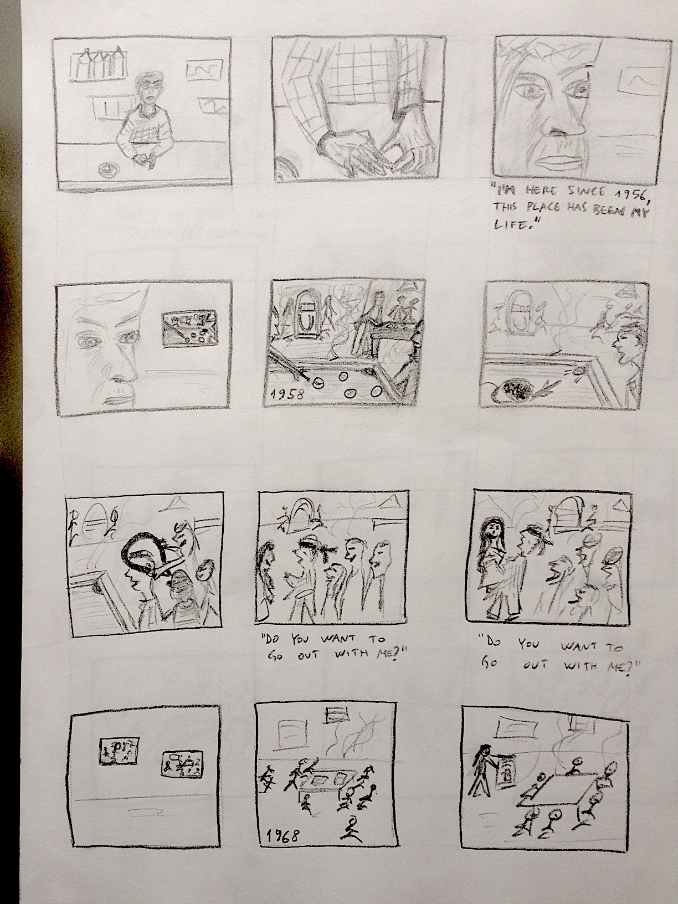
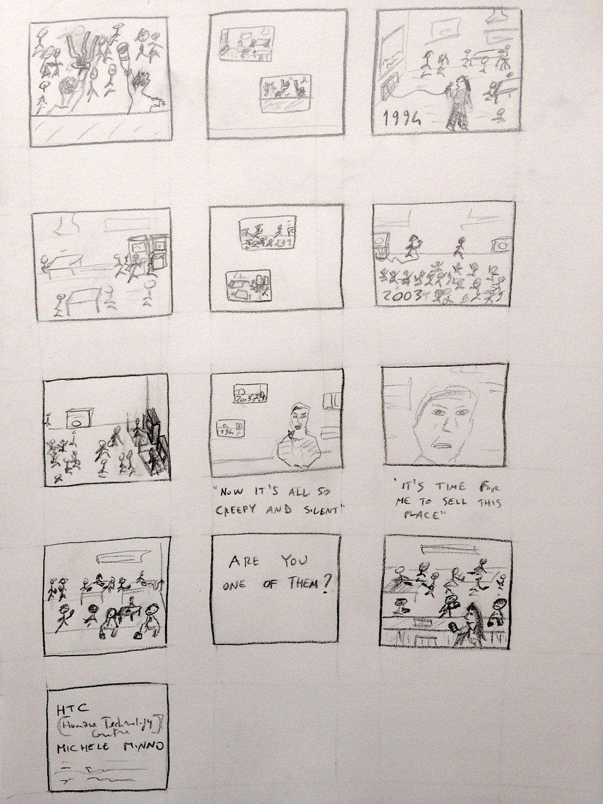

## Storyboard
Draft of the storyboard with relative music segments.

- [Initial scene music (first 10 seconds) ](https://www.youtube.com/embed/PT2_F-1esPk?start=0&end=10&autoplay=1)

- ['50s scene music (time range: 00:17 - 00:32)  ](https://www.youtube.com/embed/ucTg6rZJCu4?start=17&end=32&autoplay=1)

['60s scene music (time range: 01:17 - 01:30)   ](https://www.youtube.com/embed/VR90gQ-SIaY?start=77&end=90&autoplay=1)

['70s scene music (time range: 00:27 - 00:44)   ](https://www.youtube.com/embed/XpqqjU7u5Yc?start=27&end=44&autoplay=1)

['80s scene music (time range: 01:35 - 01:54)   ](https://www.youtube.com/embed/o1tj2zJ2Wvg?start=95&end=114&autoplay=1)

['90s scene music (time range: 01:04 - 01:18)   ](https://www.youtube.com/embed/qM0zINtulhM?start=64&end=78&autoplay=1)

['00s scene music (time range: 03:03 - 03:16)   ](https://www.youtube.com/embed/zVVA_xJeuLw?start=183&end=196&autoplay=1)

[Present time scene music (time range: 03:37 - 03:48)   ](https://www.youtube.com/embed/PT2_F-1esPk?start=217&end=228&autoplay=1)

[Final scene and credits (time range: 00:55 - 01:10)  ](https://www.youtube.com/embed/F7khiq25Xr0?start=55&end=70&autoplay=1)
