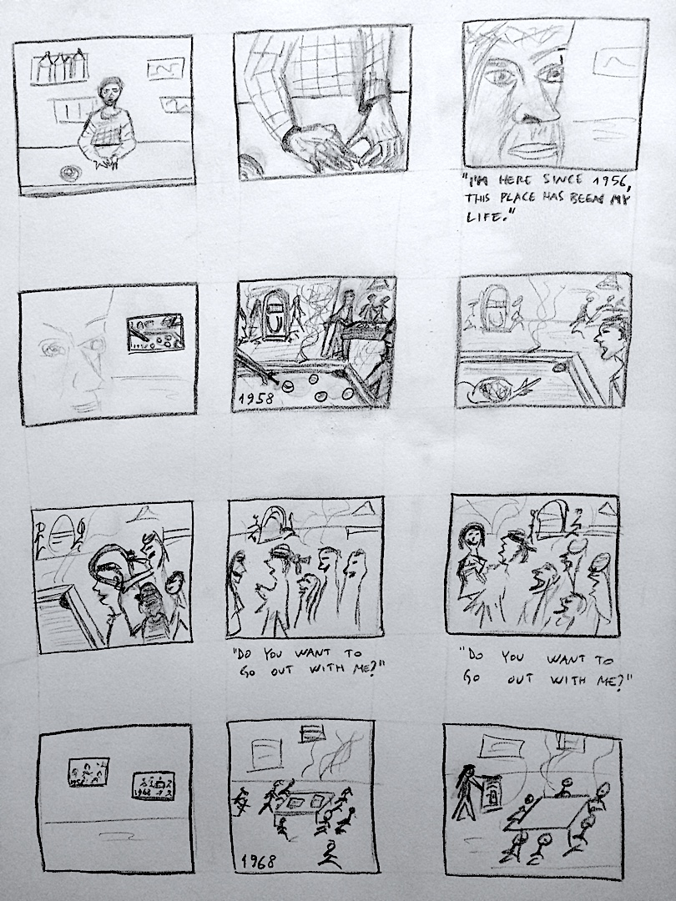

## Storyboard
Draft of the storyboard with relative music segments.

- [Initial scene music (first 10 seconds) ](https://www.youtube.com/embed/PT2_F-1esPk?start=0&end=10&autoplay=1)

- ['50s scene music (time range: 00:17 - 00:32)  ](https://www.youtube.com/watch?v=ucTg6rZJCu4&start=17&end=32)

['60s scene music (time range: 01:12 - 01:28)   ](https://www.youtube.com/watch?v=VR90gQ-SIaY&start=72&end=88)

['70s scene music (time range: 00:27 - 00:44)   ](https://www.youtube.com/watch?v=XpqqjU7u5Yc&start=27&end=44)

['80s scene music (time range: 03:44 - 04:01)   ](https://www.youtube.com/watch?v=o1tj2zJ2Wvg&start=224&end=241)

['90s scene music (time range: 00:56 - 01:11)   ](https://www.youtube.com/watch?v=wGiTPgvKktM&start=56&end=71)

['00s scene music (time range: 00:31 - 00:46)   ](https://www.youtube.com/watch?v=oVb0jvnHEpQ&start=31&end=46)

[Present time scene music (time range: 03:37 - 03:47)   ](https://www.youtube.com/watch?v=PT2_F-1esPk&start=217&end=227)

[Final scene and credits (time range: 00:55 - 01:10)  ](https://www.youtube.com/watch?v=F7khiq25Xr0&start=55&end=70)
